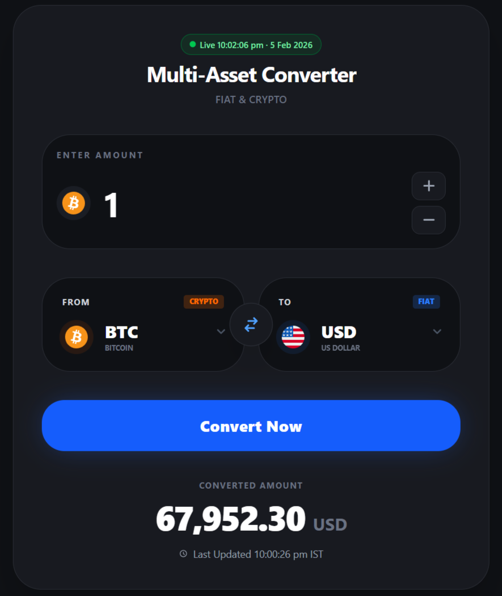
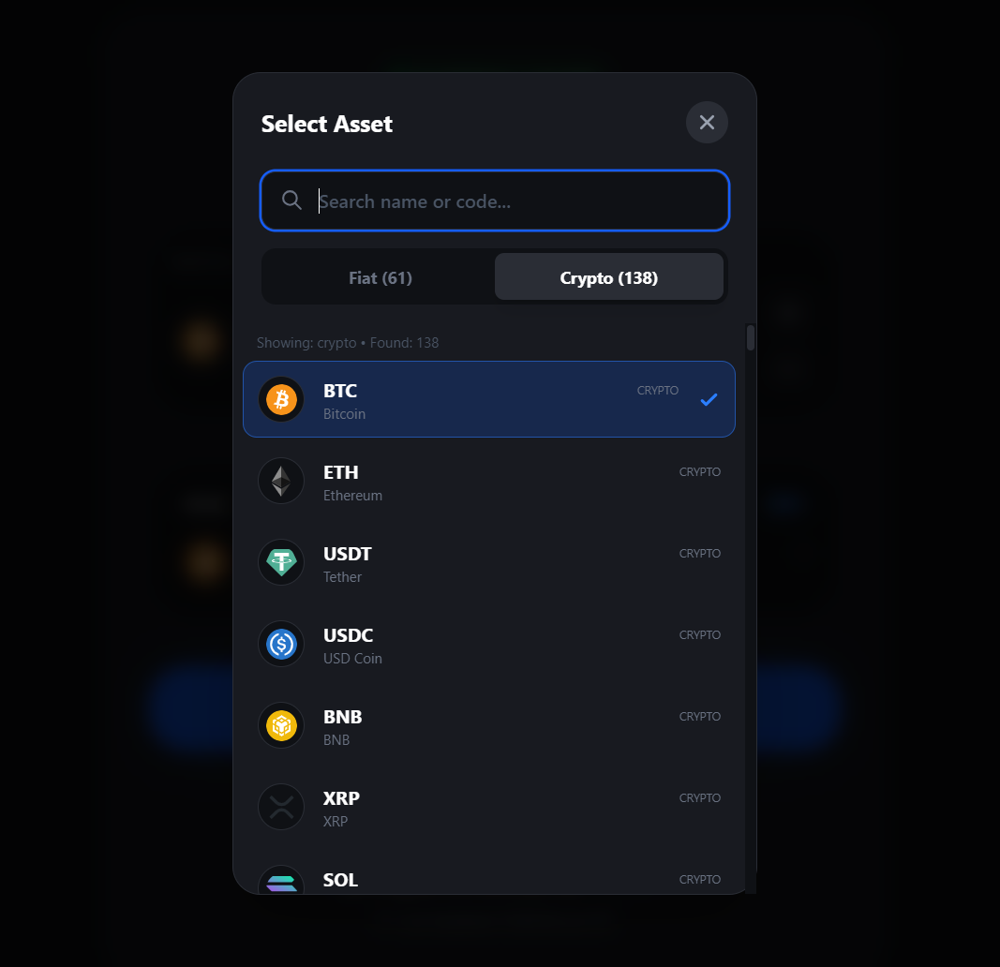
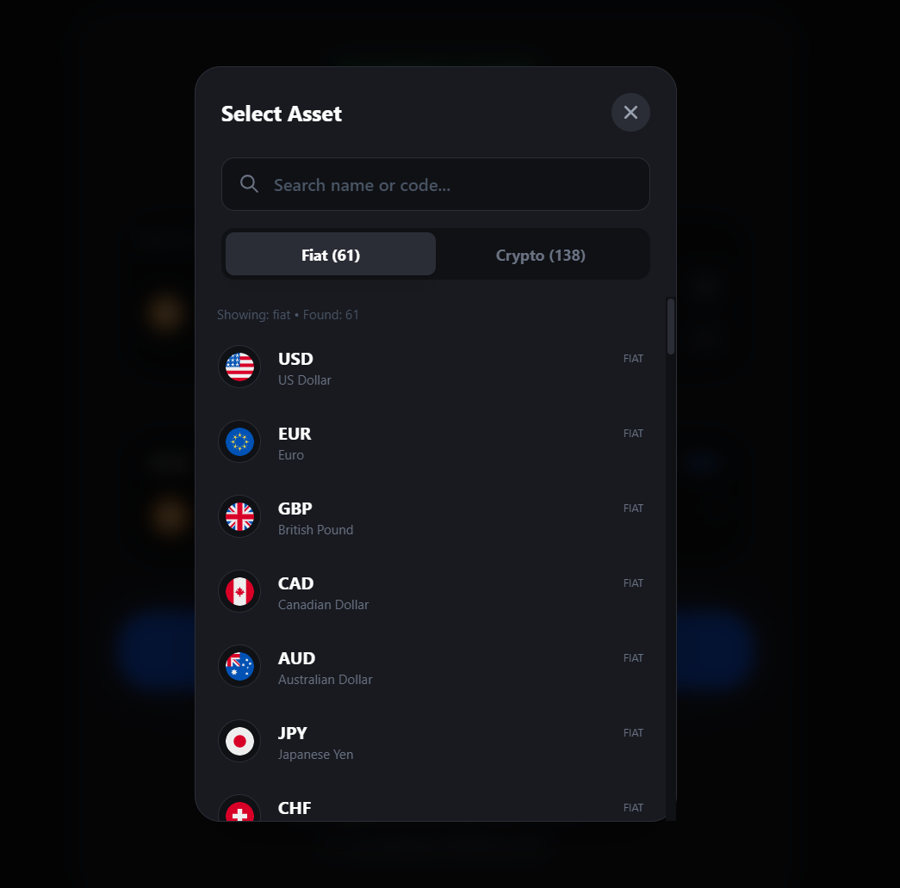

# 💱 Multi-Asset Currency Converter

### 🚀 Real-time Fiat & Crypto Conversion Platform

A modern **production-ready multi-asset converter** supporting both **crypto and fiat currencies** with real-time rates, sleek UI, and blazing fast performance.

Built with **React + Vite + Node.js + Coinbase API** and deployed on **Vercel**.

---

## 🖼️ UI Preview

### 🔥 Main Converter UI



### 🪙 Crypto Asset Selector



### 💵 Fiat Asset Selector



---

# ✨ Features

### ⚡ Real-Time Conversion

* Live crypto & fiat exchange rates
* Powered by Coinbase API
* Instant calculation

### 🧠 Smart Asset Selector

* Search by currency name or code
* Separate **Fiat & Crypto tabs**
* 100+ crypto supported
* 60+ fiat currencies

### 🎨 Premium UI/UX

* Glassmorphism dark theme
* Smooth transitions
* Live update indicator
* Mobile responsive
* Clean fintech-grade design

### 🔁 Bidirectional Conversion

Convert:

* Crypto ➜ Fiat
* Fiat ➜ Crypto
* Crypto ➜ Crypto
* Fiat ➜ Fiat

### ☁️ Production Ready

* Vercel deployment config
* Environment variable support
* Clean modular structure
* API separated architecture

---

# 🏗️ Tech Stack

### Frontend

* React (Vite)
* Tailwind CSS
* Component-based architecture
* Axios API calls

### Backend

* Node.js
* Express
* Coinbase exchange API
* Environment secured

### Deployment

* Vercel (frontend + backend)
* Serverless API routes

---

# 📁 Project Structure

```
Currency-main-app/
│
├── backend/
│   ├── server.js              # Express server
│   ├── .env                   # API keys
│   └── src/
│       ├── api/
│       │   └── convert.js     # Conversion route
│       └── lib/
│           └── coinbase.js    # Coinbase API logic
│
├── frontend/
│   ├── Components/
│   │   ├── AmountInput.jsx
│   │   ├── AssetSelector.jsx
│   │   ├── ConversionResult.jsx
│   │   ├── ConverterForm.jsx
│   │   ├── RealTimeIcon.jsx
│   │   └── StepButton.jsx
│   │
│   ├── src/
│   │   ├── App.jsx
│   │   ├── App.css
│   │   ├── lib/currencies.js
│   │   └── services/api.js
│   │
│   ├── public/
│   └── index.html
│
├── vercel.json
└── README.md
```

---

# ⚙️ Environment Variables

## Backend `.env`

```
PORT=5000
COINBASE_API=https://api.coinbase.com/v2/exchange-rates
```

## Frontend `.env`

```
VITE_API_URL=http://localhost:5000/api
```

For production (Vercel):

```
VITE_API_URL=/api
```

---

# 🧪 Local Development

## 1️⃣ Clone repo

```bash
git clone https://github.com/MrAsacker/Multi-Asset-Converter.git
cd  Multi-Asset-Converter
```

## 2️⃣ Install dependencies

### Backend

```bash
cd backend
pnpm install
```

### Frontend

```bash
cd ../frontend
pnpm install
```

---

## 3️⃣ Run locally

### Start backend

```bash
cd backend
pnpm start
```

### Start frontend

```bash
cd frontend
pnpm dev
```

App runs at:

```
http://localhost:5173
```

---

# 🌍 API Endpoint

### Convert Currency

```
GET /api/convert?from=BTC&to=USD&amount=1
```

### Response

```json
{
  "from": "BTC",
  "to": "USD",
  "amount": 1,
  "converted": 67952.30,
  "rate": 67952.30
}
```

---

# 🚀 Deployment (Vercel)

Already configured using:

```
vercel.json
```

### Deploy instantly

```bash
npm i -g vercel
vercel
```

Set environment variables in Vercel dashboard:

```
BACKEND_URL
```

---

# 🔒 Security Notes

* `.env` ignored via gitignore
* No API keys exposed to frontend
* Server handles rate fetching
* Production safe

---

# 📈 Future Improvements

* 📊 Price charts
* ⭐ Favorites currencies
* 🔔 Rate alerts
* 🌐 Multi-language
* 📱 PWA support
* 🪙 More exchanges (Binance, Kraken)

---

# 👨‍💻 Author

**Built with obsession for clean UI & speed**

If you like this project:

* ⭐ Star the repo
* 🍴 Fork it
* 🚀 Deploy your own version

---

# 🏆 License

MIT License — free to use & modify.
